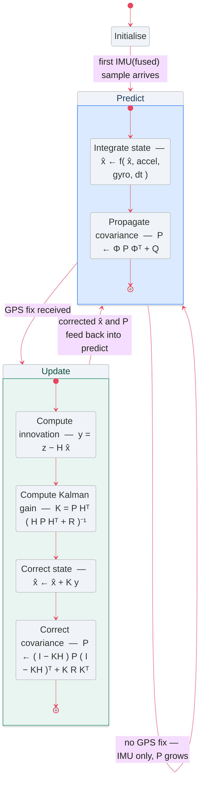
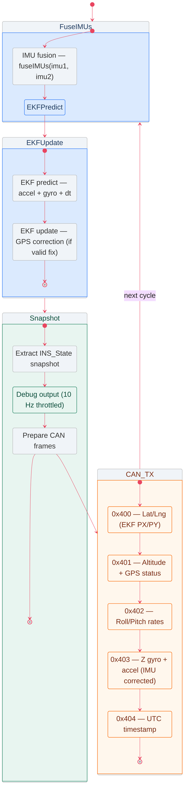

# PT Motorsport INS V0.12

Internal Navigation Systems offer reliable and accurate data related to vehicle and driver performance in real world conditions that create opportunies for teams to increase performance. This tranlastes to laptime deltas of seconds on a club race to milliseconds at the highest level where those precise gaps are the difference between qualifiying or poll position.

Comercial systems offered by leaders in the field offer high precision, low noise and are offten tightly coupled to their other products to allow for seamless integration into pre-exisitng platforms. 
These products often have the price tag to match.

### Target: 
Our product is tailored towards begining race teams or track club events. \
Solution: we offer a low barrier to entry system that does well enough at the base level but can be greatly extended.

### Product goals:
- match hardware level accuracy
- offer wide compatibility accross different Ecu brands as potential cost of 'seamless integration'
- alternative standalone configuration (where ecu limiations restrict integration)
- lower cost (offered as dev kit)

### Product Features:
- 2x Discrete 6 Axis IMU for industry level accuracy coupled with dynamic noise filtering.
- 25hz GPS module for class leading precision.
- CANbus interface for direct to ECU data logging and sensor comparison.
- discrete altimeter and thermometer for acurate environmental logging.
- Lap timer (1.0 release)

### Plug & Play infrastruture:

```mermaid
%%{init: {'theme': 'base', 'themeVariables': {'fontSize': '18px', 'lineColor': '#e94560', 'mainBkg': '#f0f4f8', 'nodeBorder': '#aaaaaa', 'textColor': '#222222', 'clusterBkg': 'transparent', 'clusterBorder': 'transparent'}, 'flowchart': {'curve': 'basis'}}}%%
flowchart TD
    subgraph Standalone
        A(Mount module) --> B(Power on)
        B --> C(Initialise sensors)
        C --> D(GPS Zeroing)
        D --> E(Data logging activated)
    end
    subgraph Integrated
        F(Install module) --> G(Power on vehicle)
        G --> H(Initialise sensors)
        H --> I(Button press GPS zeroing)
        I --> J(Data logging activated)
        J --> K(Button-press lap start, sets virtual gate)
    end
```

# Tech Stack

The system is built around the **Renesas RA4M1** microcontroller, which provides reliable real-time signal processing using an **Arm Cortex-M4 @ 48 MHz** core. This gives enough compute headroom for sensor fusion, EKF estimation, and communication tasks without introducing significant latency.

A key advantage of the RA4M1 is its wide range of built-in peripherals, enabling fast and efficient communication with sensors (I2C, SPI, UART) without overloading shared data buses. It also includes native CAN support, reducing external component count and simplifying overall hardware design.

The entire system is integrated onto a custom PCB, allowing tight coupling of GPS and IMU sensors. This improves mechanical stability, reduces wiring noise, and ensures consistent sensor alignment for more accurate state estimation.

### Extended Kalman Filter Architecture:
Maintaining a consistent world model via an Extended Kalman Filter provides the most reliable method for estimating vehicle state. By fusing IMU and GPS data, it reduces drift and improves stability compared to raw sensor readings alone. In practice, this enables centimetre-level precision when GPS is available, rather than meter-level accuracy from GPS-only solutions.

The EKF acts as the central estimator, continuously predicting motion from inertial inputs and correcting it with GPS updates when valid fixes are available. This balance between prediction and correction ensures smooth, real-time state estimation suitable for vehicle tracking and control.

### Data Logging Architecture:
A dual-core or multithreaded approach could be used to separate EKF processing, debugging, and CAN transmission into independent tasks. However, for the current scope, a single-core sequential pipeline is sufficient and preferred for simplicity.
This design keeps execution deterministic: IMU fusion → EKF predict/update → state snapshot → debug output → CAN dispatch all run in a fixed order each loop. It avoids the complexity of shared-state synchronization, inter-core communication, and timing race conditions.
Overall, the decision prioritises clarity and reliability over scalability, with room to parallelise later if computational load increases.

# Development Guide
1) Clone repository
2) Edit the `platformio.init` file to inlcude your specific dev board (ensure chip specs are similar)
3) Run `pio -run -e <board name> -t compiledb` to compile code and generate commands for your language server.

4) Flash board via usb with `pio run -t upload`

5) While still connected run `pio device monitor` to look at dbg messages in serial out

6) Start by running it across a clearly marked section of spece (car park etc). take note of the general/average values. Focus intial efforts on Tuning the Filter with hard coded values.

note: debug mode is activated with a flag in `src/main.cpp` throttled to 10hz for realtime human readability

## Kalman Filter Tuning Guide 

| Parameter | Where in code | What it affects | How to tune | Symptoms if wrong |
|----------|---------------|------------------|-------------|-------------------|
| Initial P (state covariance) | `P_(i,i) = 1.0f` | Initial confidence in state | Increase if startup is unstable, decrease if overly jumpy | Too high → noisy start, too low → slow convergence |
| Q (process noise) | `Q_(i,i) = 0.0001f` | Trust in motion model (IMU) | Increase for aggressive dynamics, decrease for smoother stability | Too low → laggy response, too high → jittery drift |
| GPS position noise (R) | `R(0,0), R(1,1), R(2,2)` | Trust in GPS updates | Increase if GPS is noisy, decrease if GPS is accurate | Too low → snaps to bad GPS, too high → ignores GPS |
| Accel bias states (BAX/BAY/BAZ) | `processModel()` | Long-term drift correction | Increase Q if drift persists | Too low → slow drift correction, too high → unstable corrections |
| Gyro bias states (BGX/BGY/BGZ) | `processModel()` | Heading stability | Slightly increase Q for better yaw tracking | Too low → yaw drift, too high → noisy orientation |
| Velocity/position coupling (Φ matrix) | `computePhi()` | Motion dynamics coupling | Usually not directly tuned | Wrong model → unstable velocity/position |
| Attitude coupling terms | `computePhi()` | Roll/pitch/yaw interaction | Adjust indirectly via Q and bias tuning | Too aggressive → oscillation in orientation |
| dt (loop timing) | `predict()` | Integration stability | Keep consistent and low jitter | Variable dt → noise or divergence |

note: will migrate into an ekf_conf.json
